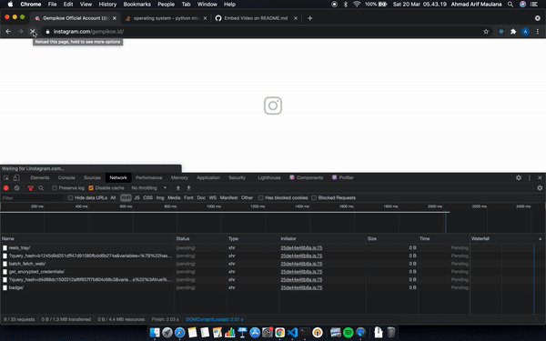

# Archive Your IG
## Overview
This script will download photos, videos, multiple photos post directly from instagram API endpoint
It's only need `public instagram account` and `query_hash` to run it

## How to get `query_hash`
To get `query_hash` is pretty simple:
 1. Log in to Instagram on your browser
 2. Open random public account
 3. Open your browser dev tools
 4. Select `Network` tab
 5. Select `XHR` to see all incoming request
 6. You will see list of requests, do not trigger any event, just scroll down until it fetch the next post request
 7. Find new request that contains `query_hash` (usually on the third call)
# 

## Requirement
To get started, you need to install python

## Usage
 1. Open your terminal
 2. Clone this repository: `git clone https://github.com/maulanaahmadarif/archive-your-ig.git`
 3. `cd archive-your-ig`
 4. Run the script `python ig.py {public_ig_account} {query_hash}`
 5. Congratulations, the script is downloading